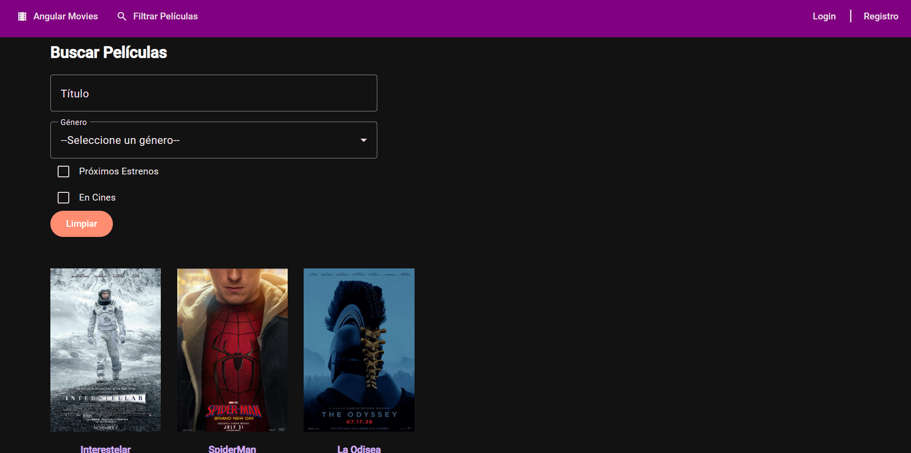
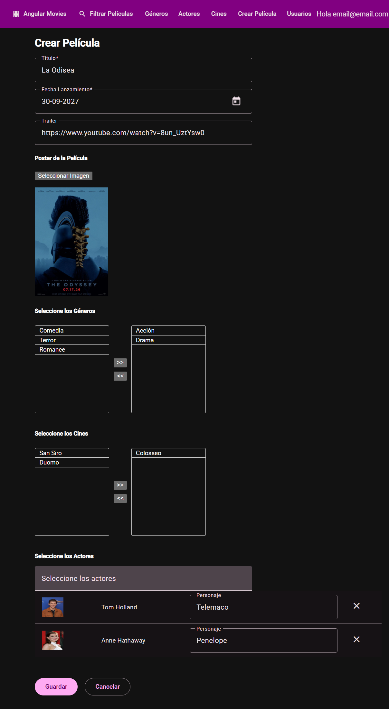
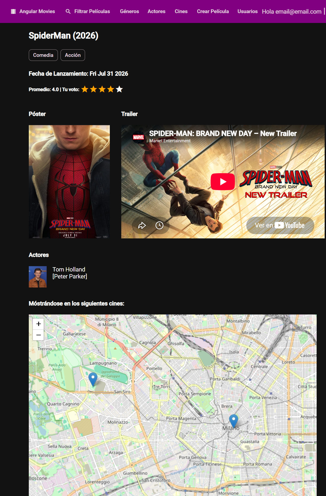
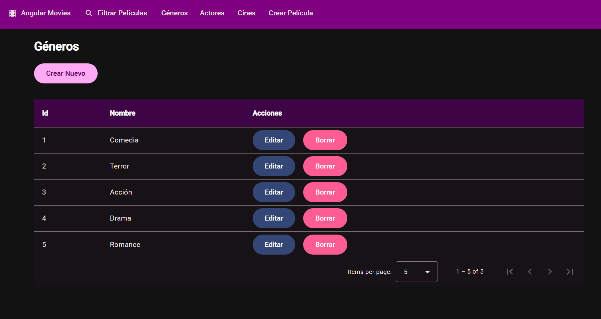

🇪🇸 [Español](README.md)&nbsp;|&nbsp;🇬🇧 English

# 🎬 Movies — Angular Client

Single-page application (SPA) built with **Angular 21** and **Angular Material** that consumes the [Movies API](https://github.com/iliana212/API_Movies) (ASP.NET Core / .NET 10). It lets users browse and filter movies, rate them, and — with the right role — manage genres, actors, cinemas and movies.

There is also a React version of this client: [React_Movies](https://github.com/iliana212/React_Movies).

   

*Folder and file names (`peliculas`, `cines`, `generos`, `seguridad`, `compartidos`…) are kept as-is from the actual codebase — they are Spanish for movies, cinemas, genres, security and shared.*

> **Status:** actively in development.

   

## At a glance

- **Landing page** with movies in theaters and upcoming releases
- **Movie filter** by title, genre, in theaters and upcoming releases, with pagination
- **Movie details** with ratings from authenticated users
- **JWT authentication**: sign up and sign in, plus an *HTTP interceptor* that attaches the token to every request
- **Route guard** (`esAdminGuard`) protecting the management of genres, actors, cinemas, movies and users
- Full CRUD with validated **reactive forms**, **image uploads**, actor autocomplete, and an **interactive map** to locate cinemas
- Services implementing a generic CRUD interface (`IServicioCRUD`) and reusable shared components

## Tech stack

| Area | Technology |
| --- | --- |
| Framework | Angular 21 (standalone components), TypeScript 5.9 |
| UI components | Angular Material, Angular CDK |
| Reactive programming | RxJS 7 |
| Forms | Reactive forms (`FormBuilder`) |
| Dates | Moment.js + Material adapter |
| Maps | Leaflet, `@bluehalo/ngx-leaflet` |
| Alerts | SweetAlert2 |
| Testing | Jasmine, Karma |

## Project structure

```
src/
├── app/
│   ├── actores/  cines/  generos/  peliculas/   # Domain modules (components + service)
│   ├── seguridad/      # Login, sign up, auth service and JWT interceptor
│   ├── compartidos/    # Reusable components, guards, interfaces and helpers
│   └── landing-page/
└── environments/       # Per-environment configuration (API URL)
```

## Getting started

### Prerequisites

- A current [Node.js](https://nodejs.org/) LTS release (20.19+ or 22.12+)
- The [Movies API](https://github.com/iliana212/API_Movies) running locally (follow its README)

### Installation

```bash
git clone https://github.com/iliana212/Angular_Movies.git
cd Angular_Movies
npm install
```

### Configure the API URL

The API URL is defined in `src/environments/environment.development.ts`:

```ts
export const environment = {
    production: false,
    apiURL: 'https://localhost:44353/api'
};
```

Adjust the port to match how you run the API: `44353` corresponds to the *IIS Express* profile; if you use `dotnet run --launch-profile https`, use `https://localhost:7263/api`.

> The API only accepts requests from allowed origins. Make sure `http://localhost:4200` (Angular's default port) is listed in the API's `origenesPermitidos` setting.

### Run in development

```bash
npm start
```

The app will be available at `http://localhost:4200` and reloads automatically when you change a source file.

## Available scripts

| Script | Description |
| --- | --- |
| `npm start` | Start the development server (`ng serve`) |
| `npm run build` | Create a production build in `dist/` |
| `npm run watch` | Rebuild on changes using the development configuration |
| `npm test` | Run unit and integration tests with Karma and Jasmine |

## Testing

The project includes unit and integration tests (Jasmine + Karma) for its critical paths:

- **Authentication**: `SeguridadService` (login, sign up, JWT, session expiration)
- **HTTP interceptor**: attaches the `Bearer` token to every request
- **Route guard**: `esAdminGuard`
- **HTTP services**: `PeliculasService`, `GenerosService`
- **Shared helpers**: query-param building, backend error extraction, form validators
- **Forms and components**: validations, event emission, and integration flows (login, creating a genre)

Run the suite:

```bash
npm test
```

Every push and pull request runs this same suite automatically via GitHub Actions (see `.github/workflows/tests.yml`).

## Related projects

| Project | Description |
| --- | --- |
| [API_Movies](https://github.com/iliana212/API_Movies) | ASP.NET Core Web API (backend) |
| [React_Movies](https://github.com/iliana212/React_Movies) | React + TypeScript client |

## Author

**Iliana Barron** — [@iliana212](https://github.com/iliana212)
